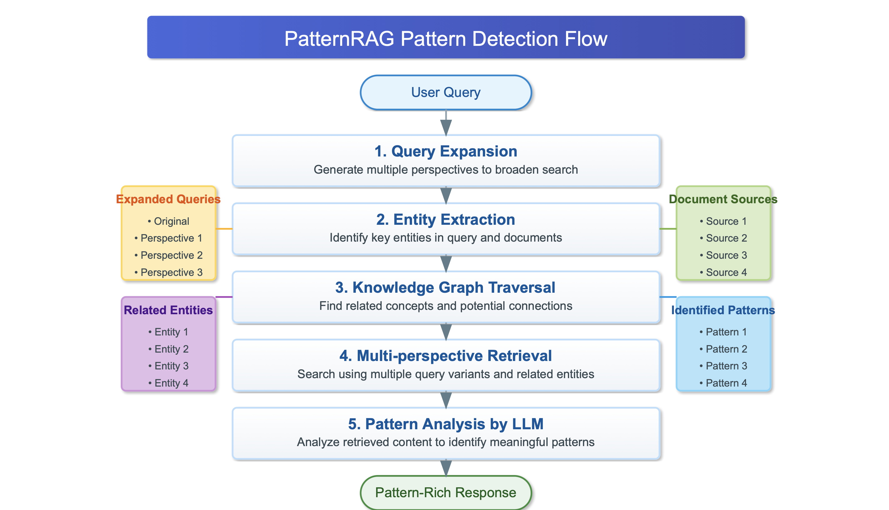

# Pattern Detection Guide

This guide explains how PatternRAG's pattern detection system works and how to optimize it for different use cases.

## Understanding Pattern Detection

PatternRAG is designed to identify non-obvious connections across documents. Unlike traditional RAG systems that focus on retrieving information semantically similar to a query, PatternRAG actively looks for patterns, correlations, and connections across diverse pieces of information.

### Key Pattern Detection Components

1. **Multi-perspective Querying**: Expanding the original query to look for connections from different angles
2. **Knowledge Graph Analysis**: Using entity relationships to identify linked concepts
3. **Cross-domain Pattern Templates**: Predefined patterns that guide the search
4. **LLM-powered Pattern Analysis**: Specialized prompting to extract meaningful relationships

## Pattern Detection Process



### 1. Query Expansion

When a query is received, PatternRAG expands it into multiple perspectives:

- The original query: "What connections exist between music and mathematics?"
- Expanded query 1: "How do mathematical principles manifest in musical composition and theory?"
- Expanded query 2: "What shared patterns exist between mathematical structures and musical harmonies?"
- Expanded query 3: "How have mathematicians and musicians influenced each other throughout history?"

This expansion helps retrieve a diverse set of documents that might not be directly related to the original query but contain relevant information for pattern detection.

### 2. Entity Extraction

The system identifies key entities in the query and in the retrieved documents:

- From the query: "music", "mathematics"
- From documents: "Pythagoras", "harmonic ratios", "Fibonacci sequence", "Bach", etc.

### 3. Knowledge Graph Traversal

Using the extracted entities, PatternRAG traverses its knowledge graph to find related concepts:

- Starting from "music": finds "harmony", "rhythm", "Bach", "scales"
- Starting from "mathematics": finds "geometry", "ratios", "Pythagoras", "patterns"
- Intersection points: "Pythagoras", "ratios", "patterns" (concepts that connect both domains)

### 4. Pattern-Guided Retrieval

The system uses both expanded queries and knowledge graph insights to retrieve documents, prioritizing those that might reveal cross-domain connections.

### 5. Pattern Analysis

Retrieved documents are analyzed using an LLM with specialized prompting that asks for:

- Similarities across different domains
- Recurring themes or structures
- Causal relationships spanning multiple fields
- Temporal patterns suggesting deeper connections
- Conceptual or structural parallels

### 6. Connection Extraction

The system extracts specific connections identified in the pattern analysis:

- "The Fibonacci sequence appears in both musical compositions and natural growth patterns"
- "Pythagoras discovered that musical harmony is based on simple mathematical ratios"
- "Both music and mathematics use patterns of tension and resolution"

### 7. Response Synthesis

Finally, PatternRAG synthesizes a response that articulates the discovered patterns and connections, citing evidence from the sources.

## Customizing Pattern Detection

### Modifying Pattern Templates

You can customize the patterns that guide the system's search by editing the `custom_patterns` list in your configuration file:

```yaml
custom_patterns:
  - "similarities between distinct domains of knowledge"
  - "recurring themes across different time periods"
  - "mathematical or structural patterns in complex systems"
  - "symbolic parallels across different disciplines"
  - "causal relationships between seemingly unrelated events"
```

For domain-specific applications, consider adding more focused patterns:

**For Scientific Research**:
```yaml
custom_patterns:
  - "methodological similarities across scientific disciplines"
  - "recurring experimental designs in different fields"
  - "parallel theoretical developments across sciences"
  - "contradictory findings on similar phenomena"
  - "evidence convergence from multiple disciplines"
```

**For Business Intelligence**:
```yaml
custom_patterns:
  - "correlations between market trends and internal metrics"
  - "behavioral patterns preceding business outcomes"
  - "operational similarities between high-performing teams"
  - "cyclical patterns in business performance indicators"
  - "causative links between seemingly unrelated business events"
```

### Adjusting Pattern Sensitivity

To modify how aggressively PatternRAG looks for connections, you can adjust these parameters:

1. **In the configuration file**:
   ```yaml
   search_depth: 2  # Increase for more speculative connections
   ```

2. **Query prefix modifiers**:
   - Add "deep pattern:" before your query for more speculative connections
   - Add "strict pattern:" for more conservative pattern detection
   - Add "standard search:" to bypass pattern detection entirely

## Pattern Detection Examples

### Example 1: Historical Influences

**Query**: "What connections exist between trade routes and the spread of religious ideas?"

**Pattern Detection Process**:
1. Query expanded to include perspectives on cultural exchange, technology transfer
2. Entities extracted: trade routes, religions, silk road, missionaries, etc.
3. Knowledge graph reveals connections between trade centers and religious monuments
4. Pattern analysis identifies temporal relationships between trade establishment and religious changes
5. Response synthesizes how trade routes served as conduits for religious ideas

### Example 2: Scientific Parallels

**Query**: "Find connections between evolutionary biology and economic theory"

**Pattern Detection Process**:
1. Query expanded to explore competition, adaptation, resource allocation
2. Entities extracted: natural selection, market competition, adaptation, etc.
3. Knowledge graph connects concepts like "survival of the fittest" with "competitive markets"
4. Pattern analysis identifies structural similarities in how both systems handle resource constraints
5. Response details how similar mathematical models describe both biological and economic competition

## Advanced Pattern Detection Techniques

### Time-based Patterns

PatternRAG can identify temporal patterns by analyzing how concepts and events relate over time:

```
Query: "What patterns exist in how technologies impact society over time?"
```

The system will look for recurring phases in technology adoption, common societal responses, and cyclical patterns in how technologies transform cultures.

### Structural Patterns

To find structural similarities between different systems or concepts:

```
Query: "What structural similarities exist between neural networks and social networks?"
```

PatternRAG will identify parallel organizational principles, information flow patterns, and functional similarities.

### Causal Pattern Detection

To investigate causal relationships across domains:

```
Query: "What causal patterns connect climate changes with human migration throughout history?"
```

The system will analyze how climate shifts preceded migration patterns and identify recurring causal mechanisms.

## Limitations and Considerations

- **Speculation Risk**: More aggressive pattern detection may identify connections that are speculative or coincidental
- **Data Dependence**: Pattern detection quality depends on the breadth and depth of your document collection
- **Interdisciplinary Bias**: The system naturally favors connections across disciplines over specialized insights within a single field
- **Historical Context**: Detected patterns may lack historical or cultural context that would affect their interpretation

## Further Reading

- [Configuration Guide](configuration.md) - Detailed options for customizing pattern detection
- [Performance Tuning](performance.md) - Optimizing pattern detection for speed and accuracy
- [API Reference](api_reference.md) - Using the API to access pattern detection features